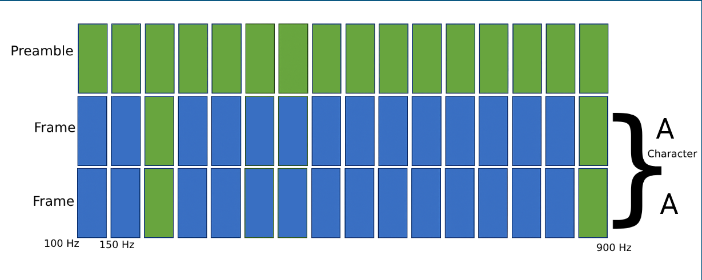
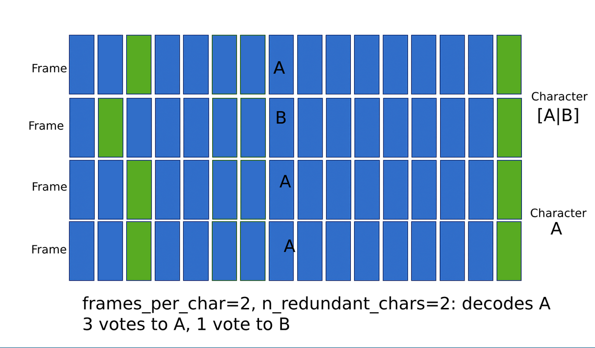
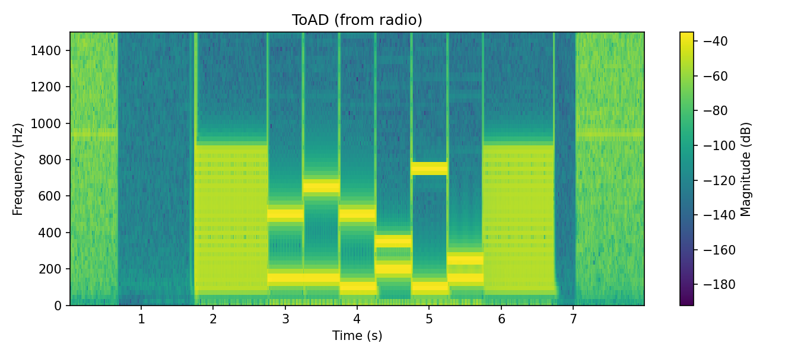
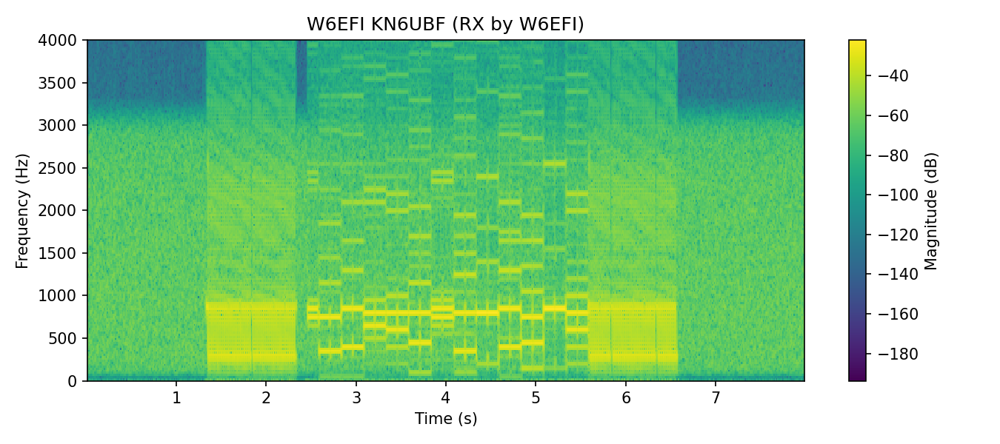
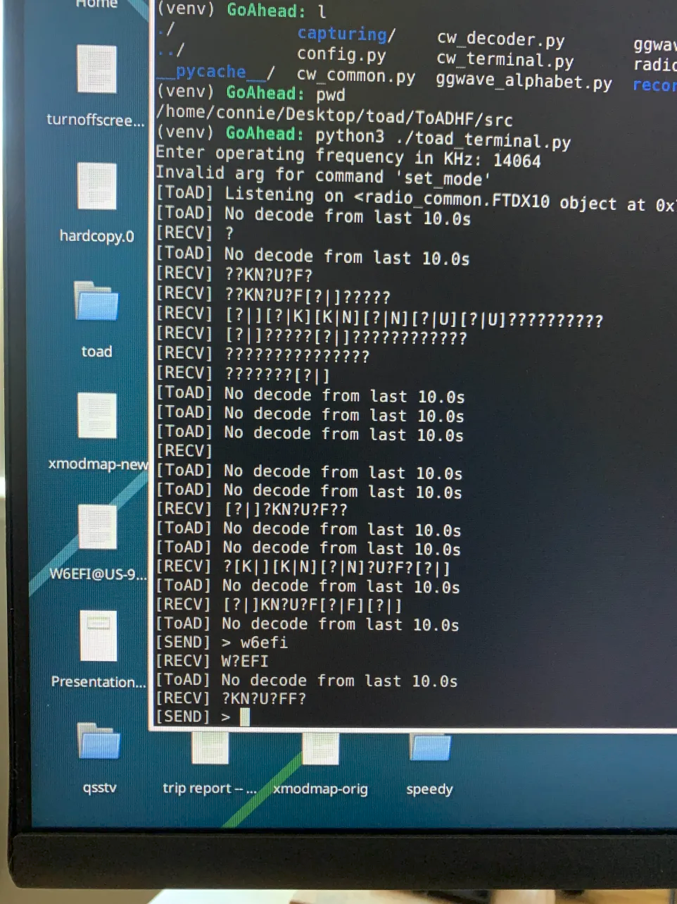

# 🐸 ToAD HF — Text over Audio (Digital) over HF

ToAD HF (*Text over Audio (Digital), over HF*) is an experimental digital mode for amateur radio, designed to be asynchronous, narrowband, ear‑ and eye‑decodable, and fun to hack on.

Unlike clock‑synchronized modes like FT8, ToAD works without an external time source and tolerates drifting HF radios. Unlike black‑box modes, it is simple and transparent. You can hear and see the tones, and even decode by hand/eye/ear at low rates.

It was built from scratch to explore how modern digital modes really work, and to demystify the process of designing one yourself.

---

## 📖 How It Works

At its core, ToAD converts text into a stream of **symbols**, sends them as pairs of audio tones, and decodes them back into text.

A typical ToAD transmission looks something like this:

```
[SFD] K N 6 U B F [EFD]
```

where `SFD` and `EFD` are framing markers that tell the decoder where the message begins and ends. Each character is encoded as a specific number of repeated bit-strings (called frames), each sent a specific number of times (the character-level redundancy value).

The following image summarizes how the ToAD protocol encodes characters:



---

## Framing

Framing is one of the trickiest parts of a digital mode, and also one of the most instructive.

ToAD currently uses asynchronous framing:

- A **Start Frame Delimiter (SFD)** of several symbols where **all 16 tones are active** marks the start.
- A similar **End Frame Delimiter (EFD)** marks the end.
- The decoder scans for these distinctive high‑energy markers and slices the message in between.

Framing is still an area of active development. Making SFD detection robust in noisy HF conditions remains a challenge, and one of the reasons modes like FT8 rely on tight synchronization.

---

## Encoding: Text to Tones

ToAD’s encoder maps text to tones through several stages:

### Text → Symbols

- ToAD uses a **45‑character alphabet** mapped into **16‑choose‑2 combinations**.
- Each character becomes a unique pair of active tones out of 16 possible bins.
- We do not use any characters with a pair of adjacent tones active to tolerate some degree of drift.
- This yields \~6 bits per symbol, though the theoretical maximum of 16‑choose‑2 is \~6.9 bits.

### Symbols → Waveform

- The sequence of symbols is padded with SFD and EFD markers.
- Each symbol is synthesized as two pure sinewaves at the correct frequencies.
- Raised‑cosine smoothing is applied to tone edges to reduce splatter.
- The entire signal is bandpass‑filtered to stay within \~900 Hz.

### Table: Encoder Parameters

| Parameter            | Value                             |
| -------------------- | --------------------------------- |
| Modulation           | 16‑tone 2‑of‑16 FSK               |
| Alphabet size        | 45 characters                     |
| Symbol rate (today)  | 8 baud (\~48 bps with redundancy) |
| Symbol rate (target) | 30 baud (\~150 bps with FEC)      |
| Bandwidth            | \~900 Hz                          |
| Tone bin width       | 50 Hz                             |
| Base tone            | 100 Hz                            |

---

## Decoding: Tones to Text

On the receive side, ToAD decodes audio with these steps:

1. **STFT** — Run a Short‑Time Fourier Transform (STFT) to generate a spectrogram.\
2.  **Tone detection** — Find the 16 frequency bins in the spectrogram.\
3.  **Framing** — Detect the SFD and EFD to isolate the message region.\
4.  **Symbol slicing** — Break the message into symbol intervals and extract each binarized tone vector.
5.  **Symbol matching** — Compare each vector to the alphabet by Hamming distance; handle ties explicitly.\
6.  **Redundancy voting** — Combine redundant symbol groups to improve confidence.

The decoder is designed to be resilient to noise and to expose ambiguity rather than hiding it: e.g., `[A|B]` if two symbols are equally likely. If a four-or-more way tie is deteced, the decoder assumes it's decoding RF noise and disregards the character.

---

## 🛡️ Error Correction & Redundancy

One of ToAD’s most important features is its ability to tolerate noise through redundancy.

Each character can be transmitted across multiple redundant symbols. At the receiver, these are grouped and voted on to determine the most likely character. The algorithm even supports tie resolution, presenting ambiguous choices explicitly when confidence is low.

Future versions of ToAD plan to add **Reed–Solomon** or **LDPC** forward error correction (FEC), which is particularly effective at correcting burst errors common on HF. Reed–Solomon is a natural fit here because it operates on blocks and is designed for noisy, bursty channels.

The following image summarizes the ToAD redundancy protocol:



---

## ToAD Alphabet:

The following is the ToAD alphabet.

```
TEXT_TO_TOAD: dict[str, str] = {
  " ": "0000000000000101",
  "0": "0000000000001001",
  "1": "0000000000010001",
  "2": "0000000000100001",
  "3": "0000000001000001",
  "4": "0000000010000001",
  "5": "0000000100000001",
  "6": "0000001000000001",
  "7": "0000010000000001",
  "8": "0000100000000001",
  "9": "0001000000000001",
  "A": "0010000000000001",
  "B": "0100000000000001",
  "C": "1000000000000001",
  "D": "0000000000001010",
  "E": "0000000000010010",
  "F": "0000000000100010",
  "G": "0000000001000010",
  "H": "0000000010000010",
  "I": "0000000100000010",
  "J": "0000001000000010",
  "K": "0000010000000010",
  "L": "0000100000000010",
  "M": "0001000000000010",
  "N": "0010000000000010",
  "O": "0100000000000010",
  "P": "1000000000000010",
  "Q": "0000000000010100",
  "R": "0000000000100100",
  "S": "0000000001000100",
  "T": "0000000010000100",
  "U": "0000000100000100",
  "V": "0000001000000100",
  "W": "0000010000000100",
  "X": "0000100000000100",
  "Y": "0001000000000100",
  "Z": "0010000000000100",
  "-": "0100000000000100",
  ",": "1000000000000100",
  ".": "0000000000101000",
  "!": "0000000001001000",
  "?": "0000000010001000",
  "@": "0000000100001000",
  "$": "0000001000001000",
  "#": "0000010000001000",
  "^": "1111111111111111",
}
```

---

## Examples

This section shows a couple of examples of ToAD in use

A spectrogram recorded locally from an IC7300's monitor channel:



A spectrogram of ToAD as recieved by W6EFI on 20m:



The first ever successful partial decode of ToAD:



An example of ToAD encoded text over audio:


---

## What’s Next

Future plans include:

- Reed–Solomon or LDPC FEC
- GPU‑accelerated decoder
- Improved preamble/postamble detection
- Testing at higher baud rates
- POTA activations, repeaters, and telemetry transports

ToAD HF is still evolving, but it already demonstrates what’s possible when curiosity meets RF.

You can follow the project on [GitHub](https://github.com/benhg/ToADHF) or reach out directly: `glick@glick.cloud` / KN6UBF OTA.
